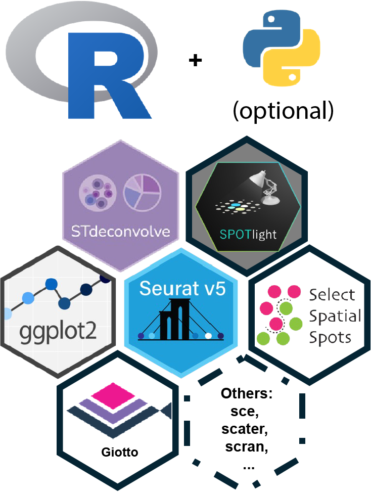

# Spatial Transcriptomics Data Analysis Pipeline

A comprehensive spatial transcriptomics analysis workflow for 10x Genomics Visium data, covering data preprocessing, integration, cell type deconvolution, and cell-cell communication analysis.

## 📁 Project Structure

```
├── scripts/                          # Analysis scripts
│   ├── 1_ReadSpatialData.R          # Spatial data loading
│   ├── 2_SpatialDataQC.R            # Spatial data quality control
│   ├── 3_IntegrationAndClustering.R # Data integration and clustering
│   ├── 4_scDataPreProcessing.R      # Single-cell data preprocessing for SPOTlight
│   ├── 5_SPOTlight_Deconv.R         # SPOTlight cell type deconvolution
│   ├── 6_SelectSpatialSpots.R       # Spatial spot selection
│   ├── 7_Unsupervised_Deconv.R      # Unsupervised deconvolution
│   ├── 8_Giotto_Communication.R     # Cell-cell communication analysis
│   └── 99_blendFeaturePlot.R        # Feature blending visualization
├── data/                            # Data directory
├── results/                         # Output results
└── README.md
```

## 🛠️ Requirements

### R Environment
- R version 4.4.3 or higher
- macOS/Linux/Windows compatible

### R Package Dependencies




#### Core Analysis Packages
```r
library(Seurat)           # Single-cell and spatial analysis
library(SeuratObject)     # Seurat object utilities
library(SPOTlight)        # Cell type deconvolution
library(Giotto)           # Spatial analysis and cell communication
library(STdeconvolve)     # Unsupervised deconvolution
```

#### Visualization & Data Processing
```r
library(ggplot2)          # Visualization
library(patchwork)        # Plot arrangement
library(dplyr)            # Data manipulation
library(tidyverse)        # Data science ecosystem
```

#### Single-cell Analysis
```r
library(SingleCellExperiment) # Single-cell data container
library(scater)           # Single-cell analysis tools
library(scran)            # Single-cell analysis methods
```

## 📊 Data Preparation

### Recommended Data Organization
```
./data/
├── GSE169749_RAW/                    # Spatial transcriptomics data
│   ├── sample_A1/
│   │   ├── filtered_feature_bc_matrix.h5
│   │   └── spatial/
│   │       ├── tissue_positions_list.csv
│   │       ├── tissue_hires_image.png
│   │       └── scalefactors_json.json
│   └── sample_B1/
│       ├── filtered_feature_bc_matrix.h5
│       └── spatial/
│           ├── tissue_positions_list.csv
│           ├── tissue_hires_image.png
│           └── scalefactors_json.json
└── GSE264408_RAW/                   # Single-cell reference data
    ├── controlExample/              # Single-cell count matrix
    └── GSE264408_metadata.csv       # Single-cell metadata
```

## 🔄 Analysis Pipeline

### 1. Spatial Data Loading (`1_ReadSpatialData.R`)
- Load 10x Genomics Visium spatial data
- Process high-resolution tissue images
- Create and save Seurat objects

### 2. Spatial Data QC (`2_SpatialDataQC.R`)
- Calculate QC metrics (nFeature, nCount, mitochondrial percentage)
- Spatial QC visualization
- Data filtering based on QC thresholds

### 3. Data Integration & Clustering (`3_IntegrationAndClustering.R`)
- SCTransform normalization
- Multi-sample data integration
- PCA dimensionality reduction and UMAP visualization
- Cell clustering and differential expression analysis
- Spatially variable feature detection

### 4. Single-cell Data Preprocessing (`4_scDataPreProcessing.R`)
- Single-cell RNA-seq quality control
- Cell type scoring using marker genes
- Reference dataset annotation

### 5. SPOTlight Cell Type Deconvolution (`5_SPOTlight_Deconv.R`)
- Reference-based cell type deconvolution using single-cell data
- Cell type proportion visualization
- Spatial cell type distribution mapping

### 6. Spatial Spot Selection (`6_SelectSpatialSpots.R`)
- Extract tissue coordinates
- Prepare spatial location data for downstream analysis

### 7. Unsupervised Deconvolution (`7_Unsupervised_Deconv.R`)
- Unsupervised cell type discovery using STdeconvolve
- Latent cell type identification

### 8. Cell-Cell Communication Analysis (`8_Giotto_Communication.R`)
- Spatial network construction
- Ligand-receptor interaction analysis
- Cell-cell communication visualization

### 9. Feature Blending Visualization (`99_blendFeaturePlot.R`)
- Multi-gene co-expression analysis
- Spatial feature blending display

## 🎯 Key Features

### Quality Control
- Automated QC metric calculation
- Interactive QC plots
- Spatial distribution visualization

### Integration Analysis
- Multi-sample data integration
- Batch effect correction
- Consensus clustering

### Cell Type Deconvolution
- Supervised (SPOTlight) and unsupervised (STdeconvolve) methods
- Spatial localization of cell types
- Quantitative proportion analysis

### Spatial Analysis
- Spatially variable gene identification
- Cell spatial co-localization
- Ligand-receptor interaction networks

## 📈 Output Results

The pipeline generates the following main results:

- **QC Reports**: Data quality assessment plots
- **Integration & Clustering**: UMAP plots and spatial clustering maps
- **Differential Expression**: Gene expression heatmaps and volcano plots
- **Cell Type Atlas**: Deconvolution results and spatial distributions
- **Communication Networks**: Cell-cell interaction diagrams

## ⚙️ Usage

1. **Prepare Data**: Organize raw data according to the recommended structure
2. **Install Dependencies**: Install required R packages
3. **Sequential Execution**: Run scripts in numerical order
4. **Parameter Adjustment**: Modify thresholds and parameters based on your data

### Basic Execution
```bash
# Run scripts sequentially
Rscript scripts/1_ReadSpatialData.R
Rscript scripts/2_SpatialDataQC.R
# ... continue with remaining scripts
```

## 🔧 Customization

### Main Adjustable Parameters
- QC thresholds (nFeature, nCount, mitochondrial percentage)
- Clustering resolution
- Differential expression parameters
- Number of cell types for deconvolution

### Key Configuration Points
- Data directory paths in each script
- Sample names and identifiers
- Image file paths and scaling factors
- Reference single-cell dataset

## ⚠️ Important Notes

1. **Memory Requirements**: Ensure sufficient memory for large spatial datasets
2. **Species Consistency**: Single-cell reference data must match the species of spatial data
3. **File Paths**: Verify correct configuration of image file paths
4. **Computational Resources**: Recommended to run compute-intensive steps in HPC environments
5. **Package Versions**: Maintain compatible package versions as specified in session info

## 📋 Session Information

This workflow was developed and tested with:
- R version 4.4.3
- Seurat 5.3.0
- Giotto 4.2.2
- SPOTlight 1.10.0
- STdeconvolve 1.3.2

For complete session info, see the R session information provided.

## 📄 Citation

If you use this pipeline, please cite the relevant analysis methods and software packages used in this workflow.

## 🤝 Contributing

Contributions and improvements to this pipeline are welcome. Please feel free to submit issues or pull requests.